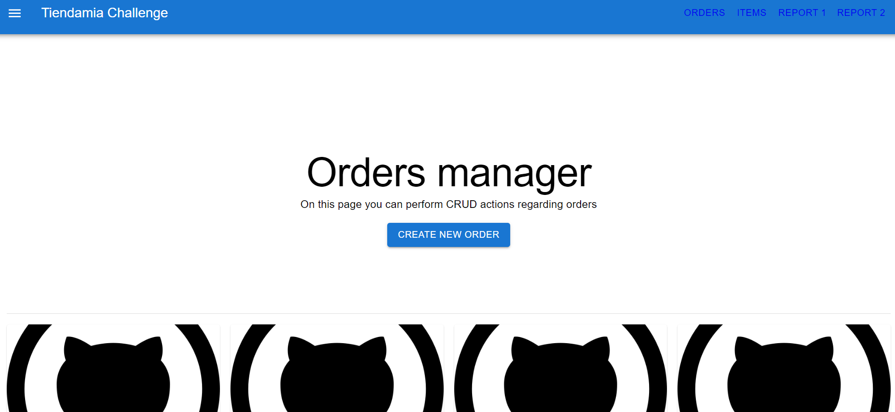
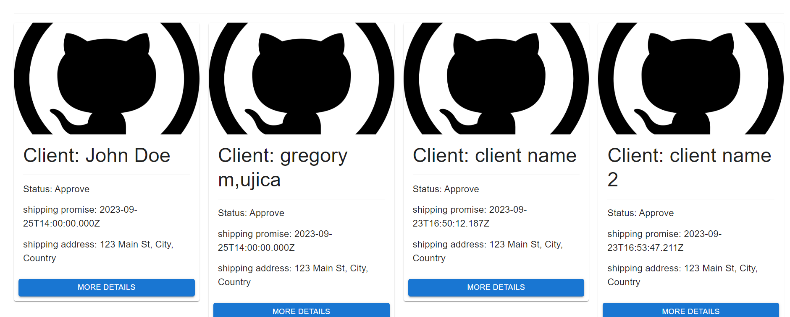
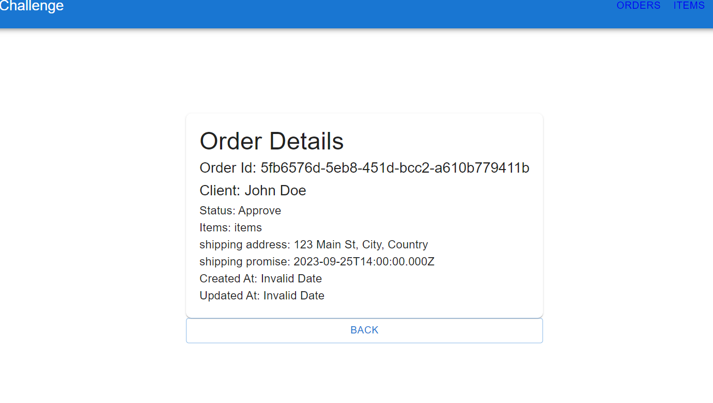
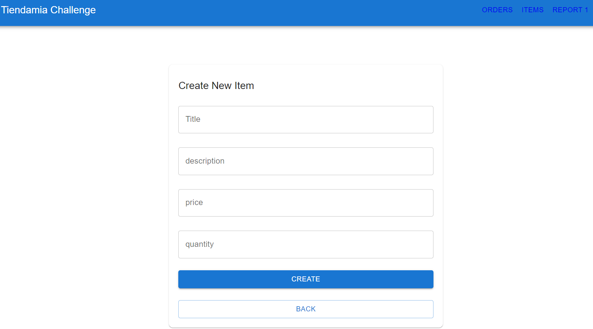
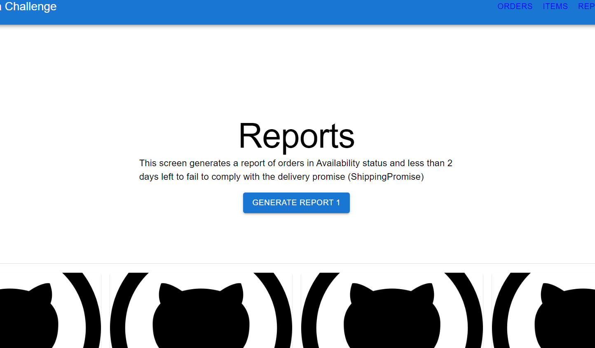

# Event manager
This is a frontend developed with reactjs for Orders handling and Reports, it consists of three modules (Orders, Items and Reports) which allow CRUD operations regarding Items and Orders.

## Available Scripts

⚙️ Base dependencies:

- [ReactJS](https://reactjs.org/)
- [Axios](https://www.npmjs.com/package/axios) 
- [Material-UI](https://mui.com/)
## Requirements

- [Node](https://nodejs.org/)
- [Npm](https://www.npmjs.com/) (preferably) or [yarn](https://yarnpkg.com/)
- [ReactJS]()

## 🚀 Lift service

### Local environment

You must have the requirements previously installed

In the terminal run the command `npm install` or` yarn` to install the necessary packages, then run the command `npm start` or` yarn start`.

The service will be lifted in http://localhost:3001

## Screens

### `Home / Orders`

### `Orders Cards`

### `Order Details`

### `Create Item`

### `Report 1`

### `Report 2`

